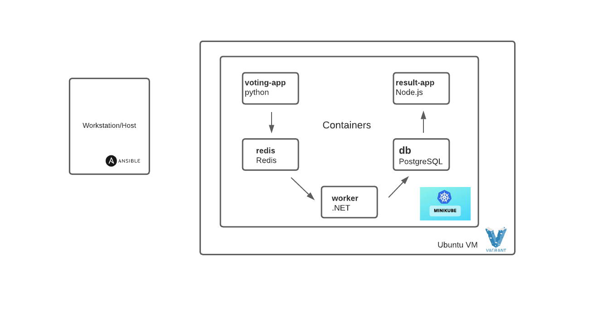

# Local Infrastructure Provisioning using Vagrant, and Cats & Dogs Voting Application Deployment
This repository contains the source code for Local Infrastructure Provisioning using Vagrant, and Cats & Dogs Voting Application Deployment using Ansible on Minikube

The deployment has two parts:

 * Infrastructure provisioning
 * Application deployemnt


## Infrastructure Provisioning

### Requirements/Prerequisites
WorkStation/Host System should  meet below requirements:
- At least ansible version 2.9
- [Virtual Box](https://www.virtualbox.org/wiki/Downloads)
- [Vagrant](https://www.vagrantup.com/docs/installation)

### VM Provisioning
## Create Virtual Machine
The VM will be using Ubuntu OS.
The vm will be created with private a IP, VM name is as below:

VM name: catdogs

To spin up the virtual machine, run the following command at the root level of the project directory:
```
vagrant up
```
##Accessing VMs 
Once the VM is up and running, you can check status with `vagrant status` or by connecting using `vagrant ssh catdogs`. 
Once you've confirmed that the virtual machine is running with no issues, copy over your personal generated SSH keys from your workstation/host to the catdogs(VM we provisioned with Vagrant) with the following command:
```
ssh-copy-id vagrant@192.168.60.5
```
When prompted, enter vagrant (that's the password for user vagrant).

Run below command to confirm you can now ssh to VM without issues:
```
ssh vagrant@192.168.60.5
```

### Provision/Create Minikube Kubernetes Cluster and Deploy Application Stack using Ansible
To provision the Minikube Kubernetes Cluster and Deploy Application Stack using Ansible, run the following command at the root level of the project directory:

 ```bash
ansible-playbook playbook.yaml
 ```

## Minukube Cluster Verification (OPTIONAL)
Loging to the catdogs VM hosting the cluster using below command:
```
vagrant ssh catdogs
or
ssh vagrant@192.168.60.5
```

Run below sample commands to verify your cluster:
First switch to root user:
```
sudo -i
```
Then run below sample verification commands:
```
sudo kubectl get nodes
sudo kubectl get all -n vote
sudo helm ls
```

###  Accessing the application

#### Voting

 ```bash
<server-ip>:31000
 ```

#### Result

 ```bash
<server-ip>:31001
 ```

#### Automated tests

The automated tests are when :

 * Merging pull requests
 * Commits
For demostration purposes only the tests are done on python files and there is only one python file from one of the containers which can modified.

Architecture
-----



* A front-end web app in Python
* A Redis queue which collects new votes
* A .NET worker which comsumes votes and stores them in
* A Postgres database
* A Node.js webapp whcih shows the esults of the voting in real time

Notes
-----

The voting application only accepts one vote per client. It does not register votes if a vote has already been submitted from a client.
